# Báo cáo Đồ án Socket: Mail Client

## Thông tin đồ án

### - Giảng viên hướng dẫn: **Thầy Nguyễn Thanh Quân**

### - Nhóm thực hiện:

- 22120368 - Phan Thanh Tiến
- 22120371 - Lý Trọng Tín

### - Thời gian thực hiện: Tháng 11/2023 - Tháng 1/2024

## Mục lục

- [1. Thông tin nhóm](#1-thông-tin-nhóm)
  - [1.1. Thành viên nhóm](#11-thành-viên-nhóm)
  - [1.2. Các chức năng đã hoàn thành](#12-các-chức-năng-đã-hoàn-thành)
  - [1.3. Bảng phân công công việc](#13-bảng-phân-công-công-việc)
- [2. Kịch bản giao tiếp của chương trình](#2-kịch-bản-giao-tiếp-của-chương-trình)
  - [2.1. SMTP](#21-smtp)
  - [2.2. POP3](#22-pop3)
- [3. Môi trường lập trình](#3-môi-trường-lập-trình)
- [4. Hướng dẫn sử dụng](#4-hướng-dẫn-sử-dụng)
  - [4.1. Chạy chương trình](#41-chạy-chương-trình)
  - [4.2. Cấu hình](#42-cấu-hình)
  - [4.3. Điều khiển các lệnh trong chương trình](#43-điều-khiển-các-lệnh-trong-chương-trình)
  - [4.4. Gửi email](#44-gửi-email)
  - [4.5. Đọc email](#45-đọc-email)
    - [4.5.1. Màn hình mailbox](#451-màn-hình-mailbox)
    - [4.5.2. Màn hình danh sách email](#452-màn-hình-danh-sách-email)
    - [4.5.3. Màn hình nội dung email](#453-màn-hình-nội-dung-email)
- [5. Tài liệu tham khảo](#5-tài-liệu-tham-khảo)

<div style="page-break-after: always;"></div>

## 1. Thông tin nhóm

- Toàn bộ mã nguồn và quá trình làm việc được lưu ở [GitHub](https://github.com/tien4112004/mail-client-java) của dự án: [https://github.com/tien4112004/mail-client-java](https://github.com/tien4112004/mail-client-java).

### 1.1. Thành viên nhóm

| MSSV     | Họ và tên       | Email                         |
| -------- | --------------- | ----------------------------- |
| 22120368 | Phan Thanh Tiến | 22120368@student.hcmus.edu.vn |
| 22120371 | Lý Trọng Tín    | 22120371@student.hcmus.edu.vn |

### 1.2. Các chức năng đã hoàn thành

| Mức độ hoàn thành | Chức năng                                                                                                            |
| ----------------- | -------------------------------------------------------------------------------------------------------------------- |
| 100%              | Đăng nhập, tạo config                                                                                                |
| 100%              | Gửi email: Gửi được cho 1 hoặc nhiều To/Cc/Bcc, gửi được nhiều file đính kèm ở nhiều định dạng                       |
| 100%              | Nhận email: Có/Không có file đính kèm, nhiều file đính kèm ở nhiều định dạng, cho phép lưu file đính kèm ra nơi khác |
| 100%              | Quản lí trạng thái đọc/chưa đọc                                                                                      |
| 100%              | Lọc email, tự động lọc email và chuyển vào mailbox (theo config), cho phép chuyển mail bằng tay vào mailbox xác định |
| 100%              | Lưu cài đặt của người dùng bằng JSON                                                                                 |
| 100%              | Tự động tải mail từ server sau một khoảng thời gian theo file config                                                 |

### 1.3. Bảng phân công công việc

| Công việc                                                                | 22120368 | 22120371 |
| ------------------------------------------------------------------------ | -------- | -------- |
| **MailSocket**: SMTPSocket                                               | x        |          |
| **MailSocket**: POP3Socket                                               |          | x        |
| **Message**: Xử lí tạo email từ thông tin cho trước, đọc thông tin email | x        |          |
| **JSON**: Đọc config, đọc/ghi trạng thái đã đọc/chưa đọc của email       |          | x        |
| **Multithreading**: Tự động tải mail về sau một khoảng thời gian         |          | x        |
| **Filter**: Lọc email                                                    | x        |          |
| **Filter**: Tự động lọc mail khi retrieve                                |          | x        |
| **UI**: Các menu, xử lí thao tác của người dùng                          | x        |          |

<div style="page-break-after: always;"></div>

## 2. Kịch bản giao tiếp của chương trình

### 2.1. SMTP

<!-- 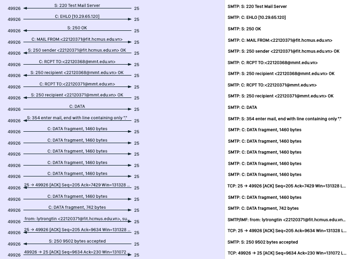 -->


- Sau khi nhận đủ thông tin từ giao diện, chuơng trình tạo một `Mail` object và gửi nó đến `SMTPSocket` để gửi đi.
- `SMTPSocket` tạo kết nối đến server, nhận phản hồi `220 Test Mail Server`.
- Sau đó, `SMTPSocket` gửi lệnh `EHLO localhost` đến server và nhận phản hồi `250 OK`.
- Sau đó, `SMTPSocket` lần lượt gửi thông tin `MAIL FROM` và `RCPT TO` đến server và nhận phản hồi `250 OK` cho mỗi lần gửi.
- Sau đó, `SMTPSocket` gửi lệnh `DATA` đến server và nhận phản hồi `354 Start mail input; end with <CRLF>.<CRLF>`. Client tiến hành gửi toàn bộ nội dung email đã xử lí trước đó, kết thúc bằng dấu `.`.
- Sau khi gửi xong, `SMTPSocket` nhận phản hồi `250 OK` và gửi lệnh `QUIT` đến server. Server trả lời `221` và đóng kết nối.
- Trong quá trình gửi, nếu gặp lỗi, `SMTPSocket` sẽ nhận phản hồi `5xx` và kết thúc kết nối.

<div style="page-break-after: always;"></div>

### 2.2. POP3

<!-- 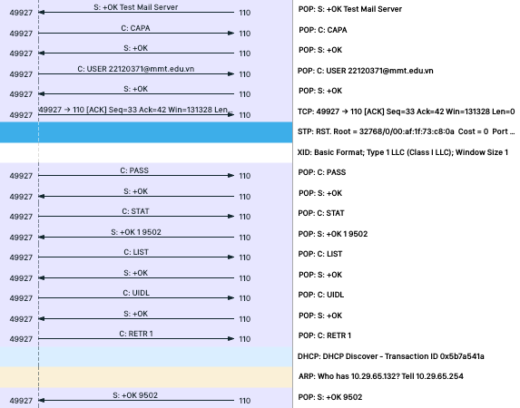 -->


- `POP3Socket` tạo kết nối đến server, nhận phản hồi `+OK`.
- Sau đó, `POP3Socket` gửi lệnh `USER <username>` và `PASS <password>` đến server để xác thực người dùng. Mỗi lệnh đều nhận phản hồi `+OK`.
- Sau đó, `POP3Socket` gửi lệnh `LIST`, nhận danh sách mail từ server. Từ danh sách nhận được này và file `MessageStatus.json`, chương trình kiểm tra mail đã từng được lấy về local hay chưa. Nếu chưa có, chương trình gửi lệnh `RETR <mail_id>` để lấy mail về.
- Sau khi lấy xong, `POP3Socket` gửi lệnh `QUIT` đến server. Server trả lời `+OK` và đóng kết nối.

<div style="page-break-after: always;"></div>

## 3. Môi trường lập trình

- Ngôn ngữ lập trình: **Java 8**.
- Package manager: **Maven**.
- Các thư viện ngoài đã sử dụng:

  - **Google Gson**: Đọc và ghi file JSON.
  - **javax.activation**: Thư viện liên quan đến đọc ghi file.
  - **JUnit**, **JUnit Jupiter**: Viết unit test.

- Các công cụ khác:

  - **Git**: để quản lý phiên bản.
  - **Thunderbird**: để test gửi/nhận email.
  - **test-mail-server**: Server giả để thử nghiệm gửi/nhận mail.

## 4. Hướng dẫn sử dụng

### 4.1. Chạy chương trình

- Môi trường thực thi: **Java Runtime Environment 8**.

- Yêu cầu hệ thống:

  - Cài đặt **Java Runtime Environment 8**, tải tại [đây](https://gist.github.com/wavezhang/ba8425f24a968ec9b2a8619d7c2d86a6).
  - Sử dụng server test [test-mail-server](https://github.com/eugenehr/test-mail-server) của [eugenehr](https://github.com/eugenehr).

- Chạy lệnh sau trên terminal để tiến hành thực thi:

  ```bash
  java -jar <tên_file>.jar
  ```

  **Chú ý:** Nếu máy có nhiều hơn một phiên bản java, cần chọn chính xác phiên bản java 8 để hạn chế các lỗi do không tương thích.

### 4.2. Cấu hình

- Cấu hình được lưu trong file `config.json` trong thư mục chứa file `jar` của chương trình.
- Trong trường hợp chưa có file `config.json`, chương trình sẽ hỏi username và password. Từ thông tin nhập vào, chương trình tạo ra file `config.json` với cấu hình mặc định.
  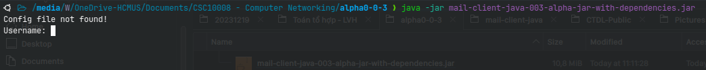

  <div style="page-break-after: always;"></div>

  - Cấu hình mặc định:

    ```json
    "General": {
      "POP3Server": "127.0.0.1",
      "POP3port": 3335,
      "SMTPport": 2225,
      "SMPTServer": "127.0.0.1",
      "Username": "example@localhost",
      "RetrieveIntervalSecond": 10,
      "Password": "*****"
    }
    ```

- Trong trường hợp đã có file `config.json`, chương trình sẽ đọc cấu hình từ file này.

- Trong lần chạy đầu tiên, file `MessageStatus.json` sẽ được tạo ra để lưu trạng thái đọc/chưa đọc của các email.

### 4.3. Điều khiển các lệnh trong chương trình

- Giao diện màn hinh chính:

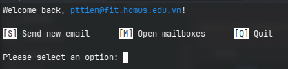

- Từ mỗi màn hình, người dùng điều khiển chương trình thông qua các lệnh đã được mô tả ở cuối màn hình.

- Ví dụ, từ màn hình chính:
  - Nhập `S` rồi nhấn `Enter` để gửi email.
  - Nhập `M` rồi nhấn `Enter` để mở mailbox.
  - Nhập `Q` rồi nhấn `Enter` để thoát chương trình.

### 4.4. Gửi email

- Từ màn hình chính, nhập `S` rồi nhấn `Enter` để vào màn hình này.

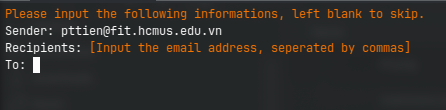

<div style="page-break-after: always;"></div>

- Người dùng tiến hành nhập các thông tin cần thiết để gửi email theo hướng dẫn nếu có.

  - **Chú ý:** Các thông tin cần được nhập chính xác. Việc chỉnh sửa thông tin sau khi nhập sẽ không được hỗ trợ.

- Mail tự động được gửi sau khi các thông tin được nhập hoàn tất. Nếu gặp bất kì lỗi nào trong quá trình gửi, chương trình sẽ thông báo ra màn hình.

  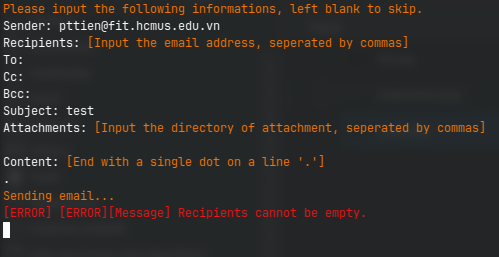

### 4.5. Đọc email

#### 4.5.1. Màn hình mailbox

- Từ màn hình chính, nhập `M` rồi nhấn `Enter` để vào màn hình này.

  - Các mailbox được đánh số thứ tự.
  - Hướng dẫn chi tiết lệnh có ở cuối trang.

- Các lệnh điều khiển:

  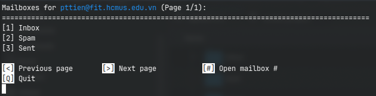

  - Người dùng chọn mailbox bằng số thứ tự tương ứng được hiển thị trước tên mailbox.
  - Sử dụng dấu `<` và `>` để chuyển trang.
  - Để thêm mailbox, người dùng chỉnh sửa file `config.json` theo cấu trúc như mặc định.

<!-- <div style="page-break-after: always;"></div> -->

#### 4.5.2. Màn hình danh sách email

- Sau khi chọn một mailbox hợp lệ, người dùng được đưa đến danh sách email.

  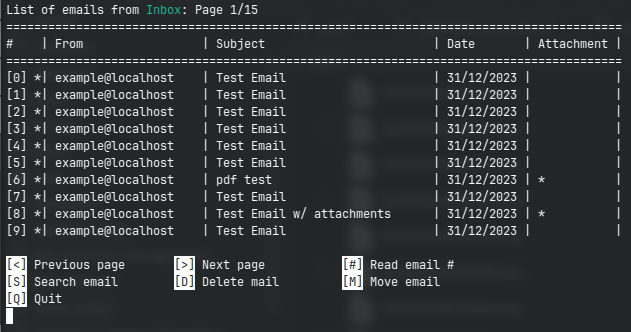

  - Các email được đánh số thứ tự.
  - Các email chưa đọc có một dấu `*` ngay sau số thứ tự.
  - Hướng đẫn chi tiết lệnh có ở cuối trang.

- Các lệnh điều khiển:

  - Người dùng chọn email bằng số thứ tự tương ứng được hiển thị trước tiêu đề email.
  - Sử dụng dấu `<` và `>` để chuyển trang.
  - Sử dụng `D` để xóa email.
    - Sau khi nhập `D`, người dùng cần nhập thứ tự của email cần xóa đang được hiện trên màn hình.
      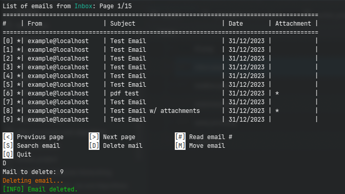
  - Sử dụng `S` để tìm kiếm email.

    - Sau khi nhập `S`, người dùng cần cho chuơng trình biết tìm kiếm theo người gửi, tiêu đề hay nội dung và từ khóa.

      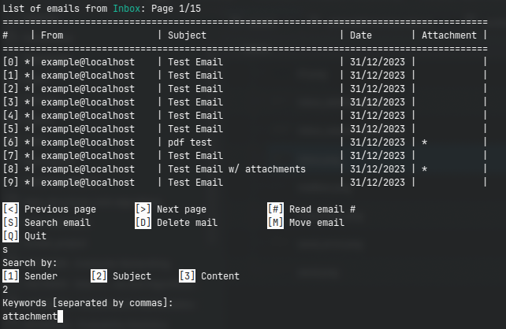

    - Ta nhận được kết quả:

      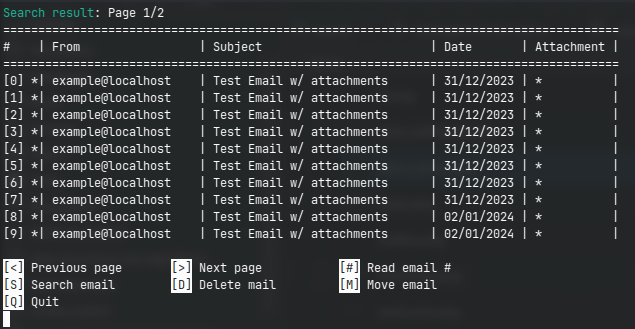

  - Sử dụng `M` để di chuyển email vào mailbox khác.

    - Sau khi nhập `M`, người dùng sẽ được hỏi di chuyển email nào và mailbox đích.

      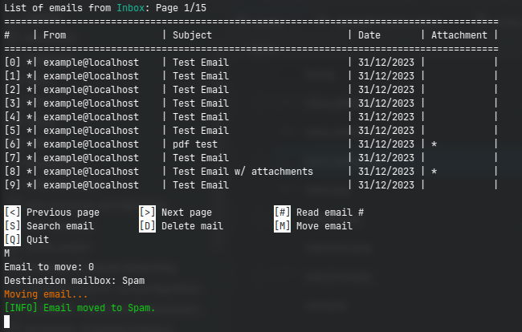

#### 4.5.3. Màn hình nội dung email

- Sau khi chọn một email hợp lệ, người dùng được đưa đến nội dung email.

  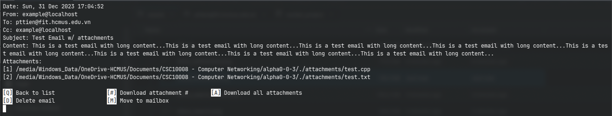

  - Chức năng xóa và di chuyển email được thực hiện như ở màn hình danh sách email.
  - Tải tất cả file đính kèm: Nhập `A` rồi nhấn `Enter` để tải tất cả file đính kèm của email hiện tại. Nguời dùng sẽ được hỏi điểm lưu file.
    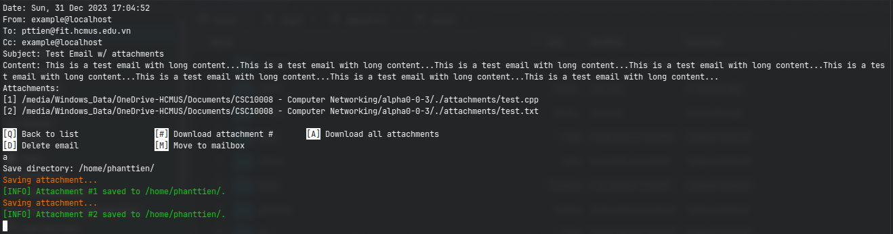
  - Tải một file đính kèm: Nhập một số thứ tự theo danh sách được liệt kê. Các bước còn lại tương tự như tải tất cả.
  - **Lưu ý:** Đường dẫn đích phải không được tồn tại các file có cùng tên với tệp đính kèm vì chương trình sẽ không ghi đè lên file cũ. Nếu tồn tại file trùng tên, chương trình sẽ báo lỗi.

<div style="page-break-after: always;"></div>

## 5. Tài liệu tham khảo

[1. Difference between CC and BCC](https://www.geeksforgeeks.org/difference-between-cc-and-bcc/)

[2. RFC 821 (SMTP)](https://www.rfc-editor.org/rfc/rfc821#:~:text=RFC%20821%20August%201982%20Simple%20Mail%20Transfer%20Protocol,are%20not%20connected%20to%20the%20same%20transport%20service.)

[3. RFC 1939 (POP3)](https://www.rfc-editor.org/rfc/rfc1939)

[4. Viblo - Muiltithreading: Lock và lock-free trong Java, từ lý thuyết đến thực tiễn](https://viblo.asia/p/008-lock-va-lock-free-trong-java-tu-ly-thuyet-den-thuc-tien-YWOZrVvEZQ0)

[5. Java API for JSON Processing: An Introduction to JSON](https://www.oracle.com/technical-resources/articles/java/json.html)

[6. JSON in Java](https://www.baeldung.com/java-json)

[7. Why does base64 encoding require padding if the input length is not divisible by 3?](https://stackoverflow.com/questions/4080988/why-does-base64-encoding-require-padding-if-the-input-length-is-not-divisible-by)

[8. MIME types (IANA media types)](https://developer.mozilla.org/en-US/docs/Web/HTTP/Basics_of_HTTP/MIME_types)
